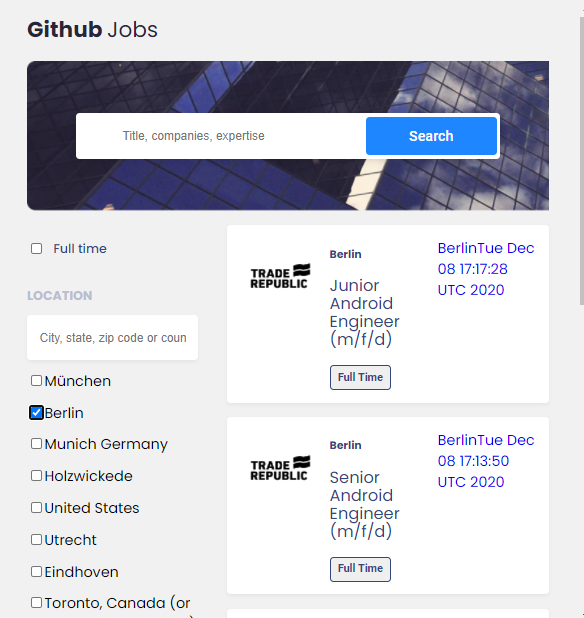

# Github Jobs

Here we are, the last graded project of this semester.

Your challenge: Create a job search using an API, and use React to handle the frontend. Don’t look at the existing solution. Fulfill user stories below:


- User story: I can see a list of jobs in a city by default
- User story: I can search for jobs with a given keyword
- User story: I can search for jobs with a city name, zip code or other location
- User story: I can select one option from at least 4 pre-defined options
- User story: I can search for a full-time job only
- User story: I can see a list of jobs with their logo, company name, location, and posted time.
- User story: When I select a job, I can see job descriptions and how to apply like the given design.
- User story: When I am on the job details page, I can go back to the search page
- User story (optional): I can see a list of jobs in the closest city from my location by default
- User story (optional): I can see jobs in different pages, 5 items each page

You’ll also have to apply a few concept we learned in class, such as a **reducer** and a global **context**. And there will be a bonus for those who can find a use case for a **compound component**.

**Icon**: https://google.github.io/material-design-icons/ (you can also use the react-icons package)

**API**: https://jobs.github.com/api. Use data from the API to create questions and answers.

*If you get some CORS errors, you can use https://cors-anywhere.herokuapp.com/ to help with accessing data from other websites that are normally forbidden by the same-origin policy of web browsers*

**Design** : https://www.figma.com/file/gAkVx9CdOqnJcCjJ7nVNkw

**Live app** : https://jolly-heisenberg-20c49e.netlify.app/

Once you completed, polish a nice readme submit your solutions on this link : https://forms.gle/Xg6kJMKmrBkyTe3TA, by providing URLs for both GitHub repository and live app on Netlify.

For the custom domain url you'll enter in netlify, please use the following naming convention : **github-jobs-_YOUR_FIRSTNAME_.netlify.app** (replace YOUR_FIRSTNAME by your firstname)

Good luck everybody!

Template for your readme :

<!-- Please update value in the {}  -->

<h1 align="center">{Your project name}</h1>

<div align="center">
  <h3>
    <a href="https://{your-demo-link.your-domain}">
      Demo
    </a>
    <span> | </span>
    <a href="https://{your-url-to-the-solution}">
      Solution
    </a>
  </h3>
</div>

<!-- TABLE OF CONTENTS -->

## Table of Contents

-   [Overview](#overview)
    -   [Built With](#built-with)
-   [Features](#features)
-   [How to use](#how-to-use)
-   [Contact](#contact)
-   [Acknowledgements](#acknowledgements)

<!-- OVERVIEW -->

## Overview



Introduce your projects by taking a screenshot or a gif. Try to tell visitors a story about your project by answering:

-   Experience

In this project, I fetched an api from github jobs. I used fetch catch to get it works very well.
When the api is not yet fetched, I displayed a loading on the page so that the user will know that it is waiting for the api loaded.

So I don’t map the response if it is still null by using Boolean condition like this: { response !== null && response.map()}. It was a real problem until I realized it but now it works well.

Filtering was also challenging, and now some of the filters do not work well except the filter of location. They mostly work but only if you use just one filter.

- Project structure

I have a context file where I have a state. I used useReducer and useContext so that I access any variables or objects from state to any files.

I fecthed my data in my App file and dispach it to the state of the reducer, in that case, the response array object from the sate receives the data. I inserted files like Jobs and JobDetails links in it as well.

The very big file is the Jobs file.
It contains things like form filters and many states. It is because I did the most of the project there whearase JobList file only cope with displaying the data on the page and so the JobDetails file.

With JobDetails file, I used useParams to get back the id of job object and with tah id, I could get any its properties to display.


-   Could be improved

I couldn’t convert the release date into number of days between the release date to now, but I think I would have done it if I had more time.

The description is confusing for me. There are a lot of elements in it and they are seen on the page. So I couldn’t handle it as well.

My css style also is a bit simple and not really well done so I think I would have made it better.

-   Something new

Thruly I learned a lot of things. For example I used slice in the JobList file to get the first five objects from the array. I had never used it before. And also I realised that the OR ( || ) opperator doesn't really work with filter so I had to use And opperator ( && ).

-   Challenging part fom me
The most challenging part was the filtering. I am still struggling with it.

-   Ather comments

I don't have a lot of comments but there was a shortage of thime.


### Built With

<!-- This section should list any major frameworks that you built your project using. Here are a few examples.-->

-   [React](https://reactjs.org/)

## Features

<!-- List the features of your application or follow the template. Don't share the figma file here :) -->

## How To Use

<!-- Example: -->

To clone and run this application, you'll need [Git](https://git-scm.com) and [Node.js](https://nodejs.org/en/download/) (which comes with [npm](http://npmjs.com)) installed on your computer. From your command line:

```bash
# Clone this repository
$ git clone https://github.com/your-user-name/your-project-name

# Install dependencies
$ npm install

# Run the app
$ npm start
```

## Acknowledgements

<!-- This section should list any articles or add-ons/plugins that helps you to complete the project. This is optional but it will help you in the future. For example: -->

## Contact

-   Website [your-website.com](https://{your-web-site-link})
-   GitHub [@your-username](https://{github.com/your-usermame})
